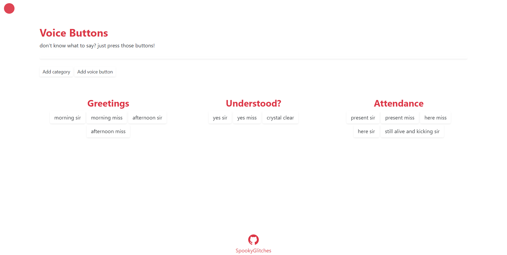

# Voice Buttons

## Main Purpose

To quickly come up of an audio feedback to the host during online classes or conferences 

## Preview 



## Getting Started

You should have MySQL and Node.JS installed.

### Installation

* Clone the repository  
    ```
    git clone 
    ```

* Install dependencies by running
    ```
    npm install
    ```
* Add audios folder under the public folder
* Add a .env file and provide your database something
    ```
    PORT=8080

    DB_HOST=
    DB_USERNAME=
    DB_PASSWORD=
    DB_NAME=voice_buttons

    UPL_PATH=./public/audios/
    ```
* Create the database
    ```
    CREATE database voice_buttons

    CREATE TABLE categories (category_id INT AUTO_INCREMENT PRIMARY KEY, title VARCHAR(255) NOT NULL)

    CREATE TABLE audios (audio_id INT AUTO_INCREMENT PRIMARY KEY, label VARCHAR(255) NOT NULL, category_id INT NOT NULL, file VARCHAR(255) NOT NULL, FOREIGN KEY (`category_id`) REFERENCES `categories` (`category_id`) ON DELETE CASCADE) 
    ```


### Executing the program

```
node app
```

## Todo

* Error handling
* Delete voice button 
* Prevent a playing audio after another button is clicked
* Delete audio file too if user presses delete category

## Contributing

Uhm ya, just don't push directly to the main branch. 
